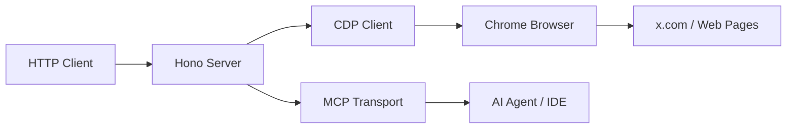

# browser-agent

> Turn your Chrome browser into a programmable HTTP API. Scrape Twitter/X timelines, search tweets, extract web pages as Markdown, sync cookies, and record browser macros — all via a lightweight local server talking to Chrome over CDP.

[](https://github.com/Leechael/browser-agent)
[](https://opensource.org/licenses/MIT)
[](https://github.com/Leechael/browser-agent/actions)
[](https://github.com/Leechael/browser-agent/releases)

[](https://star-history.com/#Leechael/browser-agent&Date)

[Changelog](https://github.com/Leechael/browser-agent/releases) · [Issues](https://github.com/Leechael/browser-agent/issues)

## ✨ Features

| Feature | Description |
|---------|-------------|
| 🐦 Twitter/X API | Read home timeline, user timelines, mentions, threads, search, and post tweets |
| 🔍 Smart Search | Advanced tweet search with filters (date range, media type, min engagement) |
| 📝 Article Extraction | Convert Twitter articles and any web page to clean Markdown |
| 🍪 Cookie Sync | Bidirectional cookie management between your browser and the server |
| 🎬 Macro Recording | Record and replay browser interactions via Chrome extension |
| 🧹 Data Cleanup | Clear cookies, storage, cache per-domain or globally |
| 🤖 MCP Support | Expose tools via Model Context Protocol (SSE & Streamable HTTP) |
| ⏱️ Timeout Controls | Fine-grained timeouts for CDP, navigation, XHR, and idle detection |

## 🚀 Quick Start

### 1. Install

```bash
git clone https://github.com/Leechael/browser-agent.git
cd browser-agent
npm install
```

### 2. Start Chrome with CDP

```bash
# macOS example
/Applications/Google\ Chrome.app/Contents/MacOS/Google\ Chrome \
  --remote-debugging-port=9222 \
  --user-data-dir="$HOME/Library/Application Support/BrowserAgent"
```

> Login to [x.com](https://x.com) in this Chrome instance before making API calls.

### 3. Run the Server

```bash
npm run dev
```

⚡ **Done!** The server is running on [http://localhost:3000](http://localhost:3000).

## 🏗️ Architecture



## 📖 API Reference

### Twitter/X Endpoints

| Method | Endpoint | Description |
|--------|----------|-------------|
| GET | `/home_timeline` | Home timeline tweets |
| GET | `/user/:screen_name` | User timeline (`?tab=tweets/replies/media`) |
| GET | `/mentions` | Mentions for authenticated user |
| GET | `/user/:screen_name/:tweet_id` | Single tweet with article Markdown |
| GET | `/thread/:screen_name/:tweet_id` | Tweet thread with replies (`?max=100`) |
| GET | `/search` | Advanced search (`?q=...&searchType=...`) |
| POST | `/tweets` | Post a new tweet |

### Browser Control Endpoints

| Method | Endpoint | Description |
|--------|----------|-------------|
| GET | `/cookies/:domain` | Get cookies for a domain |
| POST | `/cookies/:domain` | Set cookies (JSON or raw string) |
| DELETE | `/clear/:domain?` | Clear browser data per domain |
| GET | `/reset` | Reset browser to `about:blank` |

### Page Fetching Endpoints

| Method | Endpoint | Description |
|--------|----------|-------------|
| GET | `/page/*` | Fetch page HTML or extract via CSS selector |
| POST | `/page/*` | Extract multiple CSS selectors |
| GET | `/fetch/*` | Fetch page as Markdown (content-negotiation + defuddle) |
| POST | `/fetch` | Full fetch endpoint with body-based URL |

### MCP Endpoints

| Method | Endpoint | Description |
|--------|----------|-------------|
| GET | `/sse` | SSE transport for MCP |
| POST | `/messages?sessionId=...` | Message handler for SSE transport |
| POST | `/mcp` | Streamable HTTP transport (stateless) |

## ⚙️ Configuration

Create a `.env` file in the project root:

```env
# Chrome DevTools Protocol port (default: 9222)
CDP_PORT=9222

# Chrome user data directory
CHROME_USER_DATA_DIR=/path/to/your/chrome/profile

# Run Chrome without GUI
CHROME_HEADLESS=false
```

## ⏱️ Timeout Configuration

| Phase | Default | Error Type |
|-------|---------|------------|
| CDP Connection | 5000ms | `CDPConnectionTimeoutError` |
| Page Enable | 100ms | `PageEnableTimeoutError` |
| Page Navigation | 30000ms | `PageNavigationTimeoutError` |
| Page Load | 30000ms | `PageLoadTimeoutError` |
| XHR Wait | 30000ms | `XhrWaitTimeoutError` |
| Idle Detection | 3000ms | `PageLoadedWithoutMatchError` |

> HTTP API routes (except `/sse`, `/mcp`, `/messages`) have a 120-second timeout. If the browser session expires, Twitter endpoints return HTTP 403 with `{ "error": "session_expired" }`.

## 🔌 Chrome Extension

A companion Chrome extension is available for macro recording and cookie sync.

Build locally:

```bash
cd extension
npm install
npm run zip      # Chrome
npm run zip:firefox  # Firefox
```

Or download prebuilt zips from [Releases](https://github.com/Leechael/browser-agent/releases).

## 🤝 Contributing

1. Fork the repo
2. Create a branch: `git checkout -b feature/your-feature`
3. Make your changes
4. Submit a PR with a clear description

## 📄 License

MIT © [Leechael Yim](https://github.com/Leechael)
